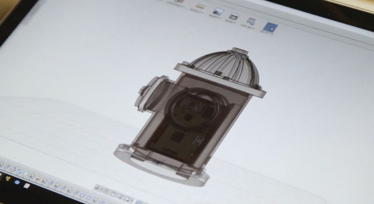

# PAW Hydrant: BTLE Scanner



## Up-and-running

Development is made easier through the use of [Docker](https://docs.docker.com/).

```
docker build -t hydrant .
docker run --privileged hydrant
```

## Configuration

You will need to configure the following environment variables

```
API_URL=<your paw api location>
LOCATION=<string used to update api>
API_UPDATE_INTERVAL=5000
SCAN_UPDATE_INTERVAL=300000
```


## Deployment and Devices

We used the following hardware internally, but in reality, you can use any device that supports bluetoothe and can run a Docker container.

- Raspberri Pi 2, Model B
- Pluggable USB Bluetooth Adapter
- A mixture of BTLE devices (this is fairly device agnostic) as the "Kibbles"

The models used to create the enclosures for the "Kibble" and the "Hydrant" can be found in the [stl/](https://github.com/istrategylabs/paw-hydrant/tree/master/stl) directory.

### Deployment

The "hydrant" can be deployed to any hardware device than can run a docker container. We deployed to our fleet using [Resin.io](resin.io) and highly recommend it.

## Extending

The Hydrant is built to work directly with the [Paw dashboard and API](https://github.com/istrategylabs/paw). You could easily clone both project and spin up your own version of the system, or you can rip out the hardcoded API endpoints and payload to have the Hydrant call any API you desire.
